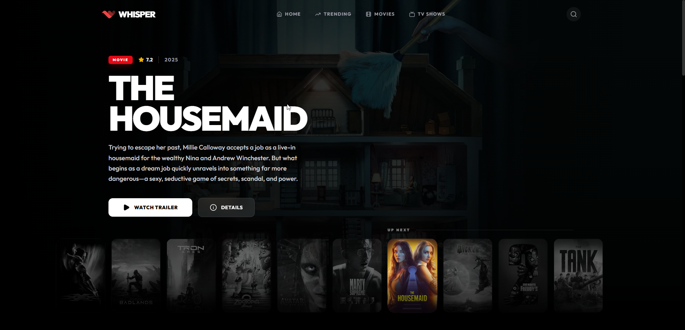
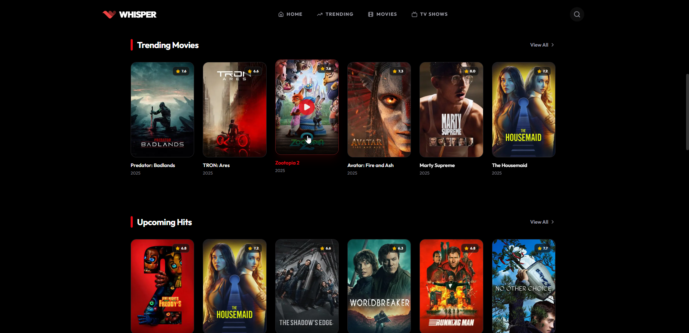
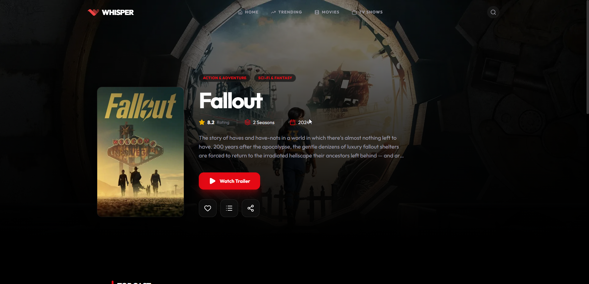
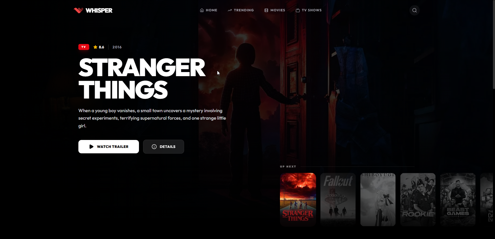
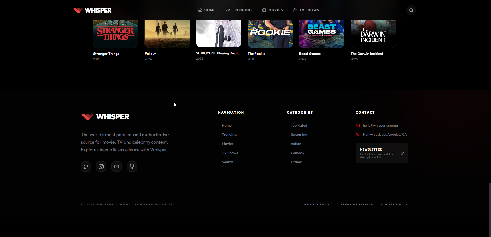
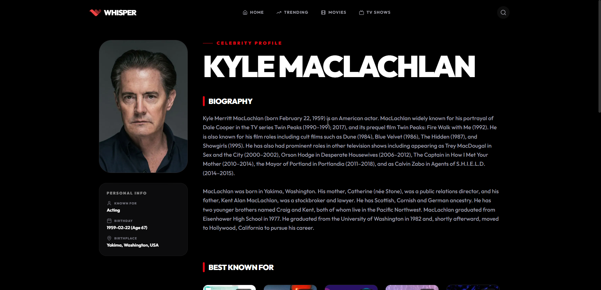
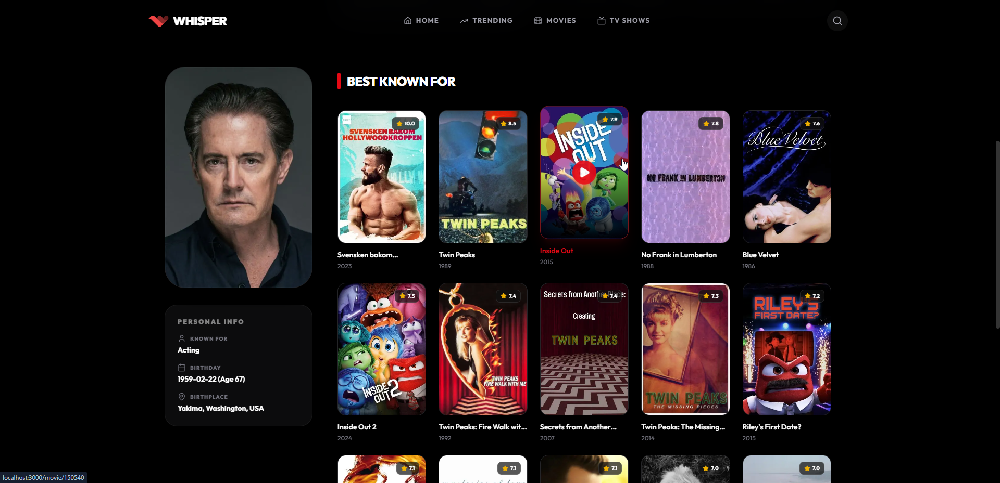
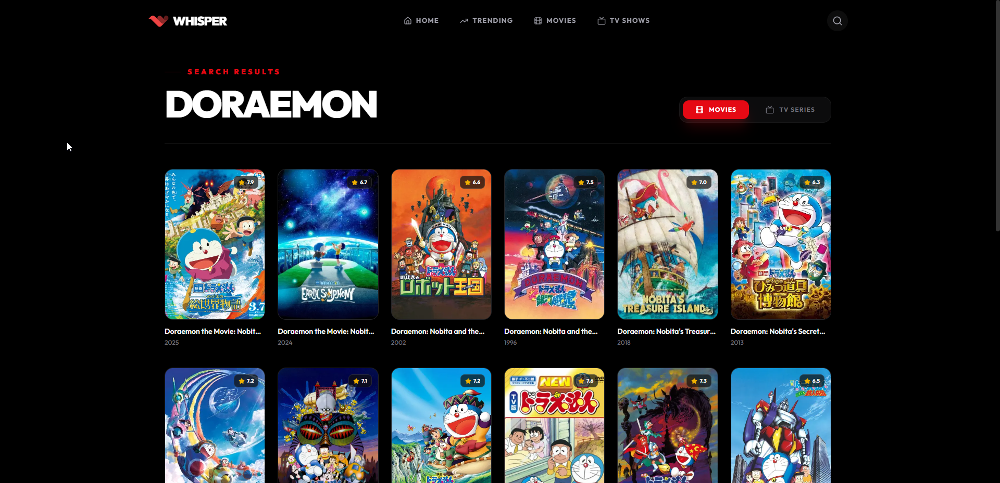
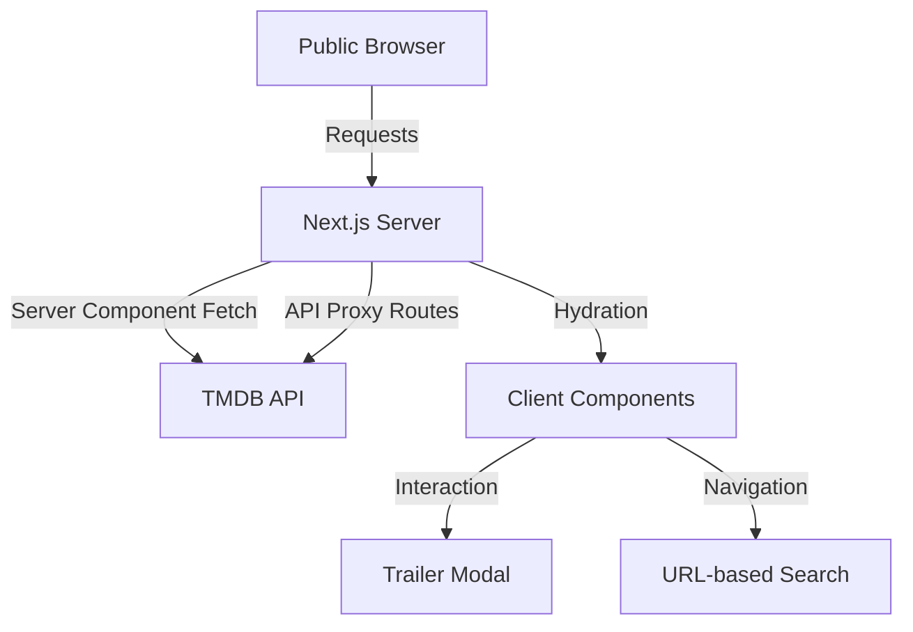

# 🎥 WHISPER — Premium Cinematic Experience

[](https://nextjs.org/)
[](https://tailwindcss.com/)
[](https://www.typescriptlang.org/)
[](https://www.themoviedb.org/)

**Whisper** is a high-end, feature-rich movie database application built with Next.js 16. It offers a seamless, immersive experience for exploring the latest movies, TV series, and celebrity content, powered by the TMDB API.

---

## 📸 Project Demos

| | | |
|:---:|:---:|:---:|
|  |  |  |
|  |  |  |
|  |  |  |

---

## 🌟 Key Features

-   📺 **Dynamic Hero Slider**: An immersive, full-screen backdrop slider with custom transitions.
-   🎬 **Instant Trailers**: Play movie and TV trailers directly in a premium, glassmorphic modal.
-   🔍 **Advanced Search**: Smooth, URL-synced search bar that expands from right to left.
-   🎭 **Detailed Profiles**: Comprehensive details for movies, TV shows, and celebrities (cast/crew).
-   ⚡ **Server-Side Excellence**: Optimized using Next.js Server Components for lightning-fast loading and SEO.
-   🛡️ **Secure API Handling**: Backend proxy routes to keep API keys private and secure.
-   💅 **Glassmorphism UI**: A consistent, dark-themed aesthetic with modern blur effects and vibrant accents.

---

## 🏗️ Architecture



---

## 🛠️ Tech Stack

-   **Framework**: [Next.js 16 (App Router)](https://nextjs.org/)
-   **Styling**: [Tailwind CSS](https://tailwindcss.com/)
-   **Animations**: [Framer Motion](https://www.framer.com/motion/)
-   **Icons**: [Lucide React](https://lucide.dev/)
-   **Slider**: [Swiper.js](https://swiperjs.com/)
-   **API**: [The Movie Database (TMDB)](https://www.themoviedb.org/)
-   **Language**: [TypeScript](https://www.typescriptlang.org/)

---

## 🚀 Getting Started

### Prerequisites

-   Node.js 18+ or Bun
-   A TMDB API Key ([Get one here](https://www.themoviedb.org/documentation/api))

### Installation

1. **Clone the repository:**
   ```bash
   git clone https://github.com/lwshakib/whisper-web-movie-db.git
   cd whisper-web-movie-db
   ```

2. **Install dependencies:**
   ```bash
   bun install
   # or
   npm install
   ```

3. **Environment Setup:**
   Create a `.env` file in the root directory:
   ```env
   MOVIE_DB_API_KEY="your_api_key_here"
   ```

4. **Run the development server:**
   ```bash
   bun dev
   # or
   npm run dev
   ```

5. **Open the App:**
   Navigate to [http://localhost:3000](http://localhost:3000)

---

## 🤝 Contributing

Contributions are what make the open-source community such an amazing place to learn, inspire, and create. Any contributions you make are **greatly appreciated**. Please see [`CONTRIBUTING.md`](CONTRIBUTING.md) for more details.

## 📄 License

Distributed under the MIT License. See `LICENSE` for more information.

## ✉️ Contact

Project Maintainer: **[@lwshakib](https://github.com/lwshakib)** — `hello@whisper.cinema`

Proudly powered by [TMDB](https://www.themoviedb.org/).
